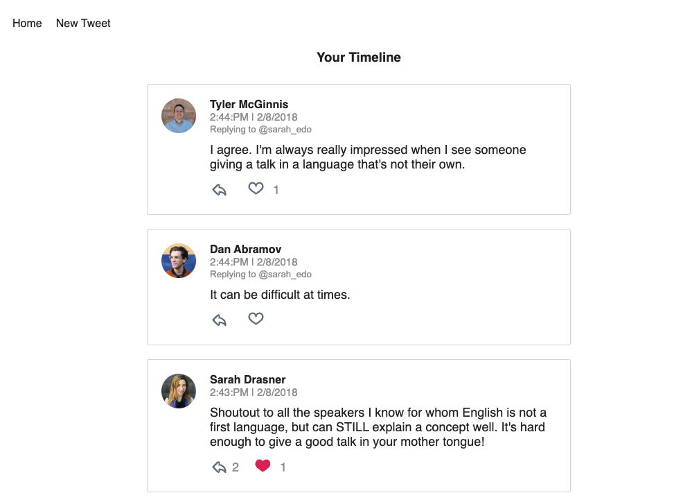
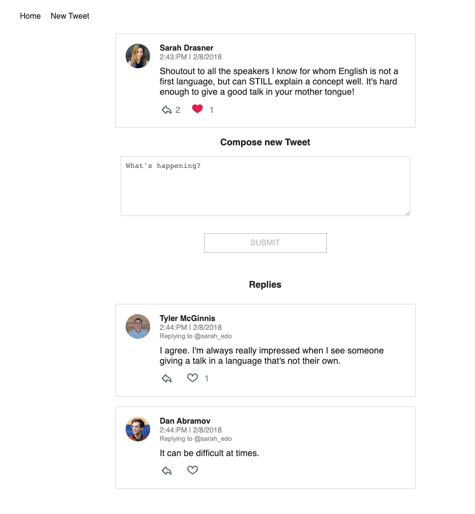
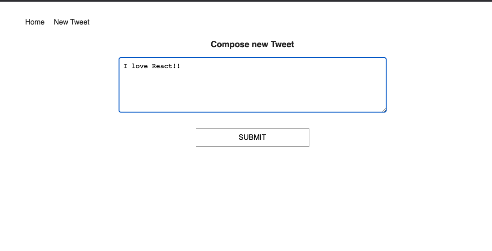

# About Project
Simple twitter clone using React and Redux
* Timeline
* Liking Tweets
* Create tweets
* Replying tweets

## Project Setup

- Clone the Project.
- Install the dependencies: `npm install`

## License

MIT
